# HTML Documentation

- [HTML English Video Tutorial](https://youtu.be/TWUf6eSi2K8)
- [Learn HTML by building a project](https://youtu.be/mgO9ObbVeJ8)
- [html complete course Bangla (Beginner to Advanced)](https://youtube.com/playlist?list=PLgH5QX0i9K3oHBr5dsumGwjUxByN5Lnw3)

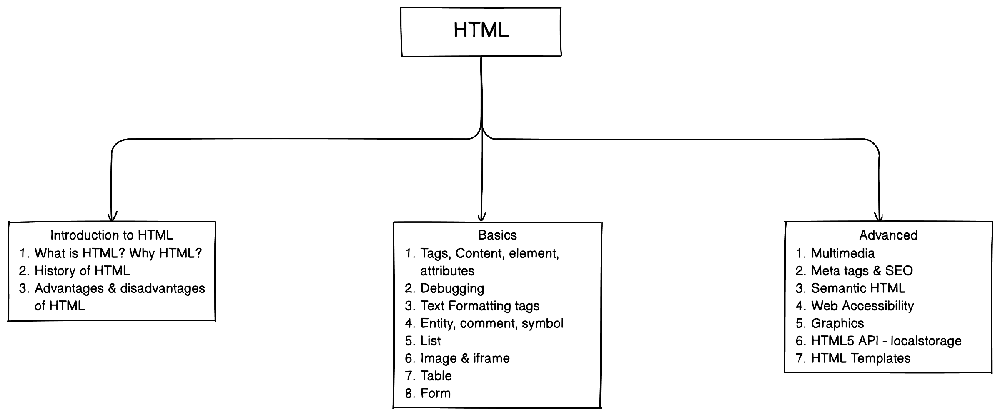

## Table of Contents

1. [Introduction to HTML](#1-introduction-to-html)
   - [What is HTML & Why HTML?](#11-what-is-html--why-html)
   - [History of HTML](#12-history-of-html)
   - [Advantages and disadvantages of HTML](#13-advantages-and-disadvantages-of-html)
2. [Basic HTML](#2-basic-html)

   - [Tags, contents, elements, attributes](#21-tag-content-attribute-element)
   - [Debugging](#22-debugging)
   - [Text Formatting tags](#23-text-formatting-tags)
   - [Entity, comment, Symbol, Color](#24-entity-comment-symbol-color)
   - [List - Ordered, Unordered, Description](#25-list---ordered-unordered-description)
   - [Link](#26-link)
   - [Image and iframe](#27-image-and-iframe)
   - [Table](#28-table)
   - [Form](#29-form)

3. [Advanced HTML](#3-advanced-html)

   - [Multimedia - audio, video](#31-multimedia---audio-video)
   - [Meta tags & SEO](#32-meta-tags--seo)
   - [Semantic HTML](#33-sematic-html)
   - [Web accessibility](#34-web-accessibility)
   - [Graphics](#35-graphics)
   - [HTML5 API](#36-html5-api)
   - [HTML Templates and Web Components](#37-html-templates-and-web-components)

## 1. Introduction to html

- What is HTML and its role in web development?
- History of HTML
- Advantages & disadvantages of HTML

### 1.1 What is HTML & Why HTML

- HTML stands for HyperText Markup Language
- It is not a **programming language** but markup language where tags are responsible for defining the elements and layout of a webpage, including headings, paragraphs, images, links, and more.

### 1.2 History of HTML

- Tim Berners-Lee created HTML in 1990
- HTML 1.0 - 1990
  HTML 2.0 - 1993
  HTML 3.0 - 1995 (Not fully implemented)
  HTML 3.2 - 1997
  HTML 4.0 - 1997
  HTML 4.01 - 1999
  HTML5 - 2014 (Ongoing development with subsequent versions like HTML5.1, HTML5.2, etc.)

### 1.3 Advantages and disadvantages of HTML

- Advantages of HTML:

1. **Easy to Learn**: HTML has a simple and straightforward syntax, making it easy for beginners to learn and understand.

2. **Platform Independent**: HTML is platform-independent and can be used on any operating system or device that has a web browser.

3. **Wide Browser Support**: HTML is supported by all major web browsers, ensuring compatibility and accessibility across different platforms.

- Disadvantages of HTML:

1. **Limited Styling Options**: HTML has limited styling capabilities compared to CSS (Cascading Style Sheets). While HTML can define basic styles, more complex and detailed styling is better achieved using CSS.

2. **Lack of Interactivity**: HTML on its own is static and lacks interactivity. To add dynamic behavior or functionality to web pages, additional technologies such as JavaScript or server-side languages are required.

3. **Browser Compatibility Issues**: Different web browsers may interpret HTML code differently, leading to potential compatibility issues. Developers must test and ensure cross-browser compatibility.

4. **Security Risks**: HTML alone does not provide built-in security features. Web developers must implement security measures and follow best practices to protect against vulnerabilities, such as cross-site scripting (XSS) attacks.

## 2. Basic HTML

- Tags, element, attributes, basic strcuture of HTML, text formatting tags, links, images, lists, tables, basic forms

### 2.1 Tag content attribute element

- [Tag, element, attribute Video Link](https://youtu.be/SEZ7YCF141I)

#### What is Tag & its syntax?

- Tag is the heart of html; HTML document is mainly built with tag.
- Tag Syntax: `<keyword>` ; Inside the angular brackets we need to write predefined keywords to use html tag.
- Small / capital letters both can be used when writing html tag; however small letter is prefered.
- Example: `<p> This is a paragraph </p>`
  In the example, `<p>` is an opening tag, `</p>` is a closing tag and `This is a paragraph` is called content. In between the starting tag to end tag we have content. Everything from starting tag to end tag is called Element

#### What are the types of Tag?

- There are 2 types of html tag: Pair/container tag and empty tag
- Pair tag has starting and ending; However, empty tag has no closing tag.
- Some of the example of pair tag and empty tags are given below:

  ```html
  <!-- Some examples of Pair/Container Tag -->
  <html>
    ...
  </html>
  <head>
    ...
  </head>
  <body>
    ...
  </body>
  <p>...</p>
  <h1>...</h1>
  <script>
    ...
  </script>
  <style></style>
  ....

  <!-- Some examples of Empty Tag -->
  <meta />
  <link />
  <br />
  <hr />
  
  <input />
  ...
  ```

#### What is attribute & how to use attribute?

- Attribute helps tag to extend its capabilities
- In the following example, `` is tag; src, height, width are the attributes

  ```html
  
  ```

- Attribute Syntax: `attributeName="attributeValue"`

#### HTML basic structure

- HTML document has 2 important part: head, body
- In the following example a basic structure of a HTML document

  ```html
  <!DOCTYPE html>
  <html>
    <head>
      TITLE, META TAG ETC.
    </head>
    <body>
      CONTENT OF THE WEBPAGE
    </body>
  </html>
  ```

- Always use `<!DOCTYPE html>` to tell the browser what type of document to expect; remember it is not a tag, just a declaration
- Every HTML document must have `<html>` pair tag and Inside `<html>` tag we use `<head>` and `<body>` as the example shows above.
- Inside head tag we use meta tag, set title etc.
- Inside body tag we write everything that we want to display on web page.

#### Environment setup

- Editor: VScode / Notepad++ / Sublime
- Browser: Google Chrome / Firefox
- Version Control: GitHub

#### First HTML Program

```html
<!DOCTYPE html>
<html lang="en">
  <head>
    <title>Document</title>
  </head>
  <body>
    This is my first webpage <br />
    I am Anisul Islam <br />
    A full stack web developer & passionate computer science teacher<br />
  </body>
</html>
```

- Here, lang attribute refers to the language; attribute value en refers to english
- Inside `<head>` tag we have set title of the webpage using `<title>` tag
- Inside `<body>` tag we are displaying some text. here `<br/>` tag creates a line break

#### Headings, Paragraph, Horizontal rule

```html
<body>
  <!--6 heading tags-->
  <h1>This is a h1</h1>
  <h2>This is a h2</h2>
  <h3>This is a h3</h3>
  <h4>This is a h4</h4>
  <h5>This is a h5</h5>
  <h6>This is a h6</h6>

  <!--to create a paragrap use p tag-->
  <p>This is a paragraph. I am writing a paragraph here.</p>

  <!--to create a horizontal rule use hr tag-->
  <hr size="2" />
</body>
```

- output of the text-formatting tags is below:
  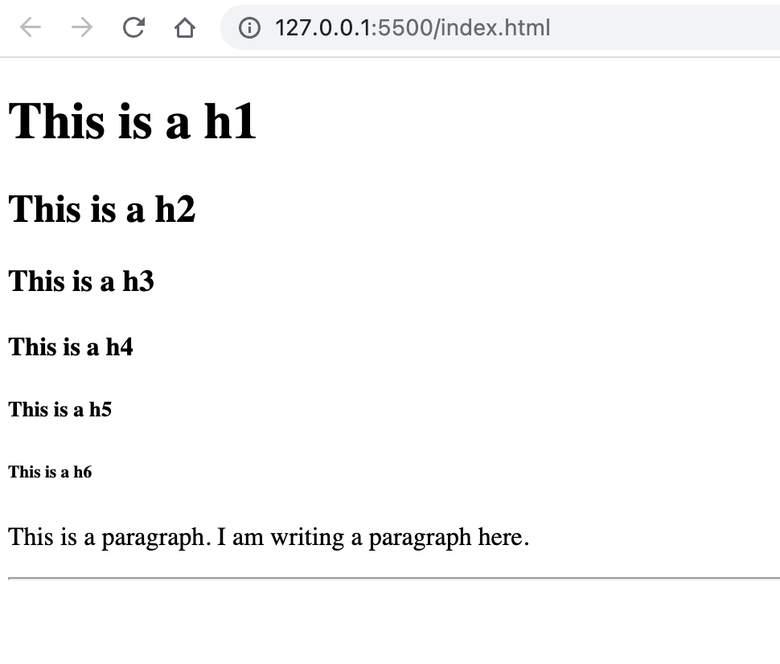

- There are 6 HTML heading levels. `<h1>` is the largest level and `<h6>` is the smallest level.
- by default, heading tags and paragraph tag create new line (block level element)
- `<hr size="2"/>` here `<hr/>` is an empty tag responsible for creating horizontal rule and size attribute set the heights of the horizontal rule in pixel

#### Styling html elemnts

```html
<!DOCTYPE html>
<html lang="en">
  <head>
    <meta charset="UTF-8" />
    <meta http-equiv="X-UA-Compatible" content="IE=edge" />
    <meta name="viewport" content="width=device-width, initial-scale=1.0" />

    <style>
      body {
        background-color: #222;
      }
      h1 {
        /* color: white; */
        /* color: #fff; */
        color: rgb(255, 255, 255);
        text-align: center;
      }
    </style>

    <title>Document</title>
  </head>
  <body>
    <h1>Bangladesh is my motherland. I miss Bangladesh a lot.</h1>
    <p style="color: green;">I also miss my family</p>
  </body>
</html>
```

- From the example, you can see that for styling html elements inside the html documents we can use style tag or style attribute
- style attribute in HTML: style="property: value; property: value..." (from the example you can see that `<p>` tag has style attribute where paragraph color is set as green)
- style tag in HTML: `<style> ... </style>` tag must be used inside the head tag as shown in this example. In this example you can see that `<h1>` and `<body>` tag has styling property like color, text-align, background-color.
- To set color of an html element we can use color name / hexadecimal color code / rgb color / hsl code as a value of color property as shown in this example for h1 tag.

### 2.2 Debugging

- Inspect Element: Within the browser developer tools, the "Inspect Element" feature allows you to examine and modify the HTML structure in real-time. You can navigate through the document tree, view CSS styles, and experiment with changes to identify and fix layout or formatting issues.
- Use Comments: Insert comments (`<!-- ... -->`) within your HTML code to temporarily remove or isolate sections of code that might be causing issues. This helps you narrow down the problematic area and identify the source of the problem.
- After writing your html code you can check the validity on this website https://validator.w3.org/

### 2.3 Text Formatting tags

- Text Formatting tags: Applying formatting to text using tags like strong, em, u, s, sup, sub, blockquote, and code.

```html
<body>
  <!-- b(bold) and strong tag are quite similar -->
  <b>This is a bold text</b> <br />
  <strong>This is a strong text</strong> <br />

  <!-- i(italic) and em(emphasize) tag are quite similar -->
  <i>This is a italic text</i> <br />
  <em>This is a emphasize text</em> <br />

  <!-- u(underline) -->
  <u>This is a italic text</u> <br />

  <!--tags can be used inside one another-->
  <b>bold. <i> italic and bold</i></b> <br />

  <mark>Important task should be highlighted</mark> <br />
  <!-- del (deleted) -->
  <del>This is a deleted text</del> <br />

  <!-- sup (superscript), sub(subscript) -->
  H<sub>2</sub>O <br />
  (a+b)<sup>2</sup> <br />

  <!-- pre tag helps to show text as you want to formatted -->
  <pre>
      This is a
        life changing documentation
      Read,learn, enjoy
        ofcourse share with others
  </pre>

  <abbr title="google is a search engine">Google</abbr>
  <address>Anisul Islam 192 anis road, London United Kingdom</address>

  <h2>What our customer thinks?</h2>
  <blockquote>
    <p>Lorem ipsum dolor sit amet, consectetur adipiscing elit. Sed varius</p>
    <footer>John Doe</footer>
  </blockquote>

  <code> console.log("hello"); </code>
</body>
```

output of the text-formatting tags is below:
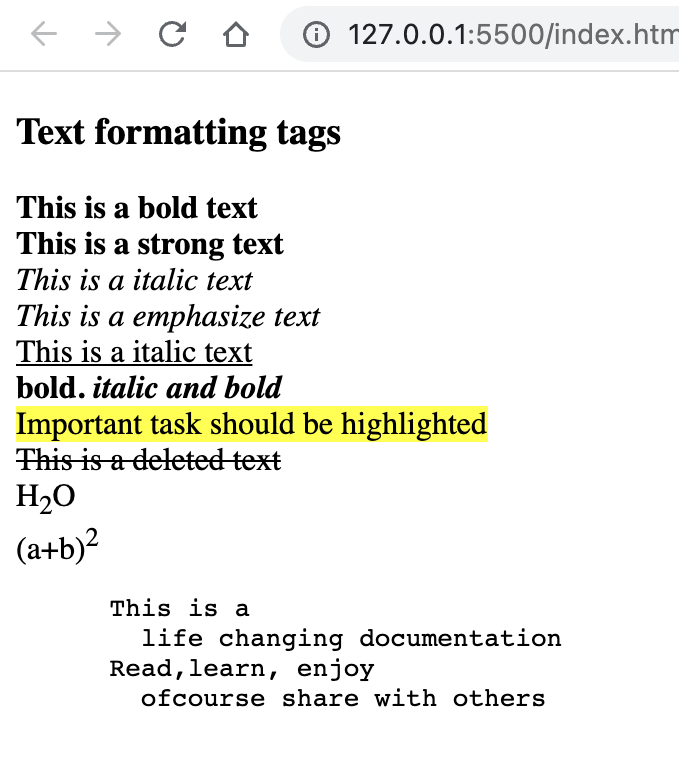

- The `<blockquote>` tag is used to enclose a block of quoted text. It is commonly used to represent quotations, excerpts, or highlighted text. The `<p>` element inside the `<blockquote>` represents the quoted text, and the `<footer>` element provides attribution or the source of the quote.

- The `<code>` tag is used to define a section of code or programming instructions. It is commonly used for displaying code snippets or highlighting code within a paragraph.

### 2.4 Entity, comment, Symbol, Color

#### Comment syntax example

```html
<!-- This is a comment -->
```

#### Entity syntax example

```html
&copy; &lt; &gt; &gt; &hearts; &nbsp;
```

- First example shows the example of a html comment
- second example shows an example of entity
- To create an entity first write & then give a keyword and then give a semicolon
- `&copy;` will create copyright symbol
- `&lt;` will create less than symbol
- `&gt;` will create greater than symbol
- `&hearts;` will create hearts symbol

#### Sources for adding symbol, icons and emoji

- Unicode character website: https://unicode-table.com/en/
- W3School emoji link: https://www.w3schools.com/charsets/ref_emoji.asp
- iconfinder icon link: https://www.iconfinder.com/

- Pick image from [unsplash](https://unsplash.com/)
- Choose color from

  - [colorhunt](https://colorhunt.co/)
  - [imagecolorpicker](https://imagecolorpicker.com/)
  - [htmlcolorcodes](https://htmlcolorcodes.com/)

### 2.5 List - Ordered, Unordered, Description

- Adding list items (li) to organize and present information.
- Mainly there are 3 types of list available in html: ordered list, unordered list, description list

  - `ol` (ordered list) tag is used for creating ordered list.
    - `<ol type="...">`: Specifies the type of ordered list markers. Values: "1" (default) for numeric markers, "A", "a", "I" for uppercase Roman numerals, and "i".
    - `<ol start="...">`: Specifies the starting value of an ordered list.
    - `<ol reversed>`: Reverses the order of the items in an ordered list.
  - `ul` (unordered list) tag is used for creating unordered list.
    - `<ul compact>: Sets the spacing between list items to be more compact.`
    - type Values: "circle" for circular markers, "square" for square markers, or "disc" for filled round markers.
  - `dl` (description list) tag is used for creating description list, dt (description term), dd (description details)
  - `li` (list) tag is a common tag for both ordered and unordered list
    example

  ```html
  <body>
    <h3>Web development front end skills</h3>
    <ol>
      <li>HTML</li>
      <li>GitHub</li>
      <li>Figma</li>
      <li>CSS</li>
      <li>Tailwind CSS / Bootstrap</li>
    </ol>

    <dl>
      <dt>Google</dt>
      <dd>Google is a search engine</dd>
    </dl>
  </body>
  ```

  output of the list code
  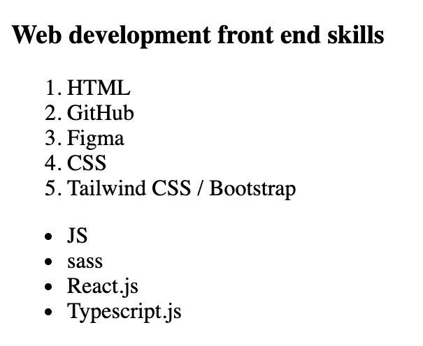

### 2.6 Link

- Linking to other pages within the website and external websites.
- Creating hyperlinks using the `<a> ... </a>` tag and understanding attributes like href, target, and rel.

  - Inside `<a>` link `href="url"` attribute is used where we give the address where we want to visit based on click
  - Inside `<a>` link `target="_blank"` attribute is used to open a new tab for the visited page/site
  - As shown in the following example we can send email by clicking the link for that we have to use `href="mailto:EMAIL_ADDRESS_HERE"`
  - As shown in the following example we can call somone by clicking the link for that we have to use `href="tel:PHONE_NUMBER_HERE"`

  ```html
  <body>
    <h3>Contact Me</h3>
    <a href="http://www.studywithanis.com" target="_blank">website</a> <br />
    <br />
    <a href="https://www.youtube.com/c/anisulislamrubel" target="_blank"
      >YouTube</a
    >
    <br />
    <br />
    <a href="tel:0017444044000" target="_blank">Call me</a> <br />
    <br />
    <a href="mailto:anisul2010s@yahoo.co.uk" target="_blank">Mail Me</a>
  </body>
  ```

  output of the html link code
  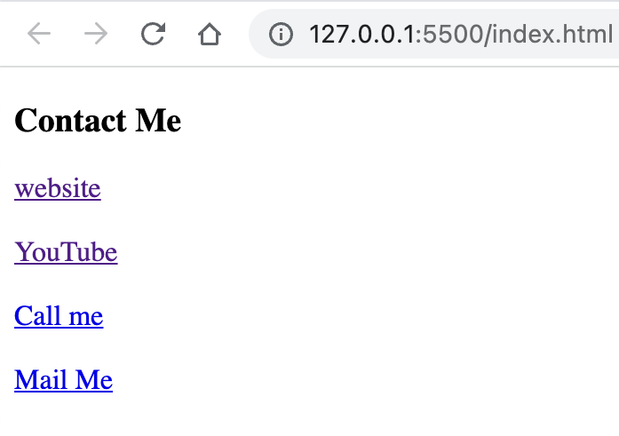

### 2.7 Image and iframe

#### image

- For adding image on webpage we use `` tag as shown in the following example.
- some common attribute for `` tag: `src, alt, height, width, title`
- syntax for adding image: ``
- `src` attribute needs the image address
- `alt` attribute shows some text about image if image is not found
- `title` attribute shows some tooltip text when we hover over the image
- `height` and `width` attribute helps us to set the height and width of image
- `loading="lazy"` if you have too many images and you want to load them lazily (after loading the other things first then you want to load images)
- we can use `` tag inside of `<a>` tag so that when we click an image it will take us to a link. `<a href="" target="_blank">  </a>`

#### iframe

- iframe helps us to display any website, youtube video or map inside our own webpage  
  iframe Example

  ```html
  <iframe
    width="560"
    height="315"
    src="https://www.youtube.com/embed/oN8aS_HW4k8"
    title="YouTube video player"
    allowfullscreen
  >
  </iframe>
  ```

### 2.8 Table

- Understanding table structure, headers, rows, colspan, rowspan and data cells.

#### HTML Basic Table

- `<table>` tag is used to create table.
- `<thead>` tag is used to create table head.
- `<tbody>` tag is used to create table body.
- `<tfoot>` tag is used to create table footer.
- `<tr>` tag is used to create table row.
- `<td>` tag is used to create table data cell.
- `<th>` tag is used to create table header cell.
- `<caption>` tag is used to create table caption.

- Follow the image to understand td, tr,
  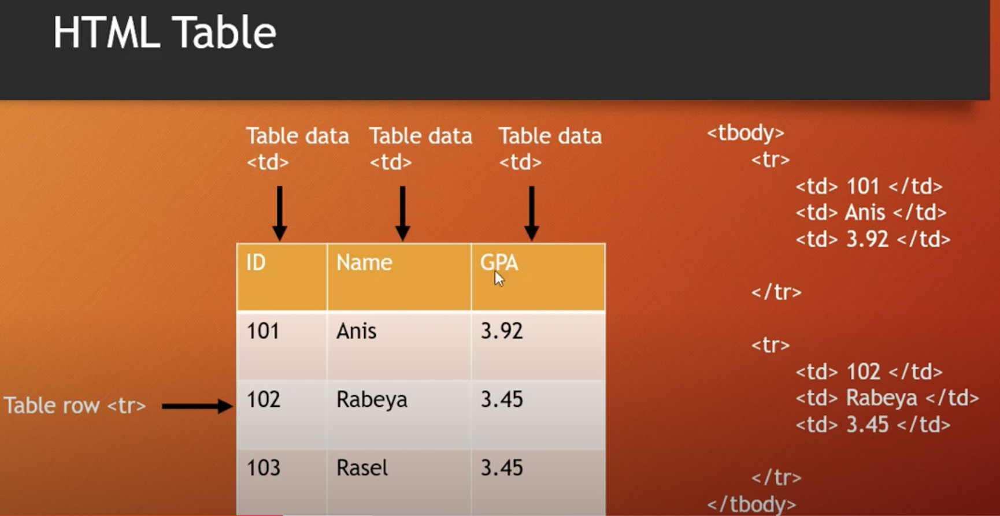

  ```html
  <body>
    <table>
      <caption>
        Student Table
      </caption>
      <thead>
        <tr>
          <th>ID</th>
          <th>Name</th>
          <th>GPA</th>
        </tr>
      </thead>
      <tbody>
        <tr>
          <td>101</td>
          <td>Anis</td>
          <td>3.92</td>
        </tr>
        <tr>
          <td>102</td>
          <td>Rabeya</td>
          <td>3.45</td>
        </tr>
        <tr>
          <td>103</td>
          <td>Rasel</td>
          <td>3.45</td>
        </tr>
      </tbody>
    </table>
  </body>
  ```

  output of the above html code
  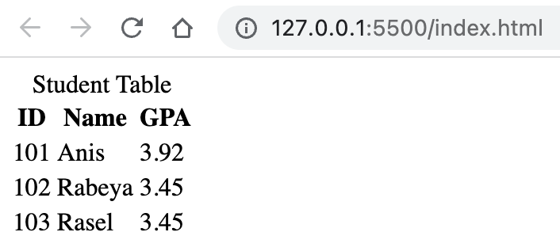

#### HTML Table rowspan, colspan

- `rowspan="N"` attribute is used to tell that a cell will expand N number of rows.
- `colspan="N"` attribute is used to tell that a cell will expand N number of columns.
- An example of rowspan is given below:

  ```html
  <!DOCTYPE html>
  <html lang="en">
    <head>
      <title>Document</title>

      <style>
        table,
        th,
        td {
          border: 1px solid;
          border-collapse: collapse;
        }
      </style>
    </head>
    <body>
      <table>
        <caption>
          Student Table
        </caption>
        <thead>
          <tr>
            <th>ID</th>
            <th>Name</th>
            <th>GPA</th>
          </tr>
        </thead>
        <tbody>
          <tr>
            <td>101</td>
            <td>Anis</td>
            <td>3.92</td>
          </tr>
          <tr>
            <td>102</td>
            <td>Rabeya</td>
            <td rowspan="2">3.45</td>
          </tr>
          <tr>
            <td>103</td>
            <td>Rasel</td>
          </tr>
        </tbody>
      </table>
    </body>
  </html>
  ```

  output of the above html code
  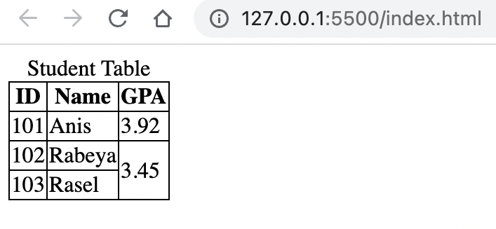

- An example of rowspan is given below:

  ```html
  <!DOCTYPE html>
  <html lang="en">
    <head>
      <title>Document</title>

      <style>
        table,
        th,
        td {
          border: 1px solid;
          border-collapse: collapse;
        }
      </style>
    </head>
    <body>
      <table>
        <caption>
          Student Table
        </caption>
        <thead>
          <tr>
            <th>ID</th>
            <th>Name</th>
            <th colspan="2">Phone</th>
          </tr>
        </thead>
        <tbody>
          <tr>
            <td>101</td>
            <td>Anis</td>
            <td>017</td>
            <td>018</td>
          </tr>
          <tr>
            <td>102</td>
            <td>Rabeya</td>
            <td>019</td>
            <td>015</td>
          </tr>
        </tbody>
      </table>
    </body>
  </html>
  ```

  output of the above html code
  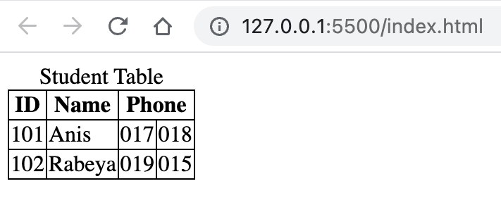

- An example of colspan and rowspan is given below:

  ```html
  <!DOCTYPE html>
  <html lang="en">
    <head>
      <title>Document</title>

      <style>
        table,
        th,
        td {
          border: 1px solid;
          border-collapse: collapse;
        }
      </style>
    </head>
    <body>
      <table>
        <caption>
          Student Table
        </caption>
        <thead>
          <tr>
            <th>ID</th>
            <th>Name</th>
            <th>GPA</th>
            <th colspan="2">Phone</th>
          </tr>
        </thead>
        <tbody>
          <tr>
            <td>101</td>
            <td>Anis</td>
            <td rowspan="2">3.45</td>
            <td>017</td>
            <td>018</td>
          </tr>
          <tr>
            <td>102</td>
            <td>Rabeya</td>
            <td>019</td>
            <td>015</td>
          </tr>
          <tr>
            <td>102</td>
            <td>Rabeya</td>
            <td>3.95</td>
            <td>019</td>
            <td>015</td>
          </tr>
        </tbody>
      </table>
    </body>
  </html>
  ```

  output of the above html code
  

#### Accessible table

- `<th scope="col/row">`
- An example of accessible table using scope is given below:

  ```html
  <!DOCTYPE html>
  <html lang="en">
    <head>
      <title>Document</title>

      <style>
        table,
        th,
        td {
          border: 1px solid;
          border-collapse: collapse;
        }
      </style>
    </head>
    <body>
      <table>
        <caption>
          Student Table
        </caption>
        <thead>
          <tr>
            <th scope="col">Student ID</th>
            <th scope="col">Name</th>
            <th scope="col">Age</th>
          </tr>
        </thead>
        <tbody>
          <tr>
            <th scope="row">101</th>
            <td>Anis</td>
            <td>31</td>
          </tr>
          <tr>
            <th scope="row">102</th>
            <td>Rabeya</td>
            <td>30</td>
          </tr>
        </tbody>
      </table>
    </body>
  </html>
  ```

  output of the above html code
  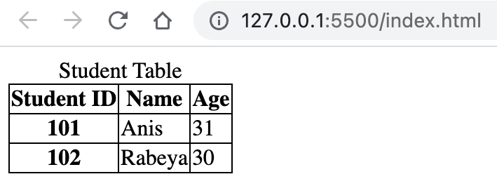

  An example of table using `<colgroup> & <col>` tags is given below:

  ```html
  <!DOCTYPE html>
  <html lang="en">
    <head>
      <title>Document</title>

      <style>
        table,
        th,
        td {
          border: 1px solid;
          border-collapse: collapse;
        }
      </style>
    </head>
    <body>
      <table>
        <caption>
          Student Table
        </caption>
        <colgroup>
          <col span="2" style="background-color: tomato" />
        </colgroup>
        <thead>
          <tr>
            <th scope="col">Student ID</th>
            <th scope="col">Name</th>
            <th scope="col">Age</th>
          </tr>
        </thead>
        <tbody>
          <tr>
            <th scope="row">101</th>
            <td>Anis</td>
            <td>31</td>
          </tr>
          <tr>
            <th scope="row">102</th>
            <td>Rabeya</td>
            <td>30</td>
          </tr>
        </tbody>
      </table>
    </body>
  </html>
  ```

  output of the above html code
  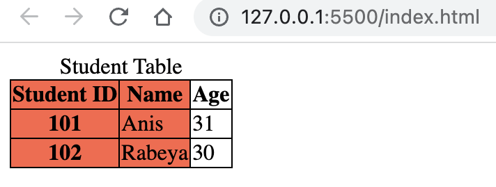

### 2.9 Form

- Using form controls like text inputs, checkboxes, radio buttons, dropdowns, and submit buttons.
- HTML `<form>` Elements:

  - `<form>` element is used to create a html form. form help us to collect user data.
  - `<input />` element is the most used form element.
  - `<label>` element is used for labelling form elements. It helps the form elements accessible byguiding the screen reader. `<label for="name">` element has `for=""` attribute which value should be equal to `<input id="name"/>` element's id value.
  - `<select>` - helps to create dropdown menu.
  - `<optgroup label="programming">` - helps to create options for dropdown menu.
  - `<option>` - helps to create options for dropdown menu.
  - `<textarea>` - helps to create multiple lines text input field.
  - `<button>` - helps to create button.
  - `<fieldset>`
  - `<legend>`
  - `<output>`
  - `<datalist>` & `list=""` attributes

- form tag attributes:

  - `<form action="/home" method="post" autocomplete="on">`-> enable the autocomplete option.
  - `<form action="/home" method="post" autocomplete="on" enctype="text/plain">`-> sends data without encoding.
  - `name=""` attribute is used to set the name of any element which is essential for getting data in server side especially.

- input tag type attribute

  - `type=""` attribute can change the visualization of `<input />` element.
  - `<input type="text"/>` creates a single line text input field.
  - `<input type="email"/>` creates a single line email input field.
  - `<input type="password"/>` creates a single line password input field.
  - `<input type="number"/>` creates a single line number input field.
  - `<input type="checkbox"/>` creates a checkbox input field.
  - `<input type="radio"/>` creates a radio button input field.
  - `<input type="button"/>` creates a clikable button.
  - `<input type="submit"/>` creates a submit button for form.
  - `<input type="color"/>` creates a color picker input field.
  - `<input type="date"/>` creates a date picker.
  - `<input type="month"/>` creates a month picker.
  - `<input type="time"/>` creates a time picker.
  - `<input type="week"/>` creates a week picker.
  - `<input type="image"/>` creates a image selector.
  - `<input type="file"/>` creates a file selector.
  - `<input type="url"/>` creates a url selector.
  - `<input type="tel"/>` creates a input field for telephone number.
  - `<input type="search"/>` is used for searching.
  - `<input type="hidden"/>` creates a input field which is not visible to user.
  - `<input type="range" min="" max=""/>` creates a range by setting min and max value, default range is 0 to 100.

  ```html
  <fieldset>
    <legend>Contact Me</legend>
    <label for="email"> Email: </label>
    <input type="email" id="email" />
  </fieldset>
  ```

- HTML Forms Validation:

  - `required` attribute specifies that an input element must be filled before submitting the form.
  - `max=""` attribute is used to set the maximum input value for an input field.
  - `min=""` attribute is used to set the minimum input value for an input field.
  - `pattern=""` attribute is used to set a regular expression for validating an input field.

- others

  - `value=""` attribute is used to set initial value for input field.
  - `readonly` attribute is used to set an input field as readonly.
  - `checked` attribute is used to set an input field already checked.
  - `disabled` attribute is used to make a input field disable.
  - `size=""` attribute is used to set the number of characters for an input field.
  - `maxlength=""` attribute is used to set the maximum number of characters for an input field.

  - `placeholder=""` attribute is used to give a hint to the users.

  - `step=""` attribute specifies steps for input field.
  - `autofocus` attribute makes an input field automatically focus when the page is loaded.
  - `height="" width=""` attribute is used to set input elements height and width.
  - `list="id_of_datalist"` attribute is used to set input elements height and width.

- A form example is given below:

  ```html
  <form action="/" method="post">
    <div>
      <datalist id="usernames">
        <option value="anis"></option>
        <option value="linkon"></option>
        <option value="ridoy"></option>
      </datalist>

      <label for="username">Username: </label>
      <input
        type="text"
        id="username"
        name="username"
        size="30"
        autofocus
        required
        list="usernames"
      />
    </div>
    <br />
    <div>
      <label for="password">Password: </label>
      <input type="password" id="password" name="password" required />
    </div>
    <br />
    <div>
      <label for="email">Email: </label>
      <input type="email" id="email" name="email" autocomplete />
    </div>
    <br />
    <div>
      <label for="phone">phone: </label>
      <input type="tel" id="phone" name="phone" />
    </div>
    <br />
    <div>
      <label for="dob">Date of birth: </label>
      <input type="date" id="dob" name="dob" />
    </div>
    <br />
    <div>
      <label for="month">favourite Month: </label>
      <input type="month" id="month" name="month" />
    </div>
    <br />
    <div>
      <label for="random">Select a random number from 1 to 5: </label>
      <input
        type="number"
        id="random"
        name="random"
        min="1"
        max="5"
        value="3"
      />
    </div>
    <br />
    <div>
      <label for="profile">Select your image: </label>
      <input type="image" id="profile" name="profile" />
    </div>
    <br />
    <div>
      <label for="file">Select a file: </label>
      <input type="file" id="file" name="file" />
    </div>
    <br />
    <div>
      <label for="color">Select favourite color: </label>
      <input type="color" id="color" name="color" />
    </div>
    <br />
    <div>
      <label for="website">Paste your website's url: </label>
      <input type="url" id="website" name="website" />
    </div>

    <!-- checkbox disable-->
    <br />
    <div>
      <p>Religion:</p>
      <div>
        <input type="checkbox" id="muslim" checked />
        <label for="muslim">muslim</label>
      </div>
      <div>
        <input type="checkbox" id="hindu" />
        <label for="hindu">hindu</label>
      </div>
      <div>
        <input type="checkbox" id="other" disabled />
        <label for="other">other</label>
      </div>
    </div>
    <!-- radiobutton -->
    <br />
    <div>
      <p>Gender:</p>
      <div>
        <input type="radio" id="male" name="gender" />
        <label for="male">male</label>
      </div>
      <div>
        <input type="radio" id="female" name="gender" />
        <label for="female">female</label>
      </div>
      <div>
        <input type="radio" id="other" name="gender" />
        <label for="other">other</label>
      </div>
    </div>
    <!-- dropdown menu -->
    <br />
    <div>
      <label for="department">Department: </label>
      <select name="department" id="department">
        <option value="cse">CSE</option>
        <option value="eee">EEE</option>
        <option value="llb">LLB</option>
      </select>
    </div>
    <!-- textarea -->
    <br />
    <div>
      <label for="message">Message: </label> <br />
      <textarea name="" id="message" cols="30" rows="10"></textarea>
    </div>
    <!-- button -->
    <br />
    <div>
      <button type="submit">Save Data</button>
      <button type="reset">Clear</button>
    </div>
  </form>
  ```

  output of the above html code
  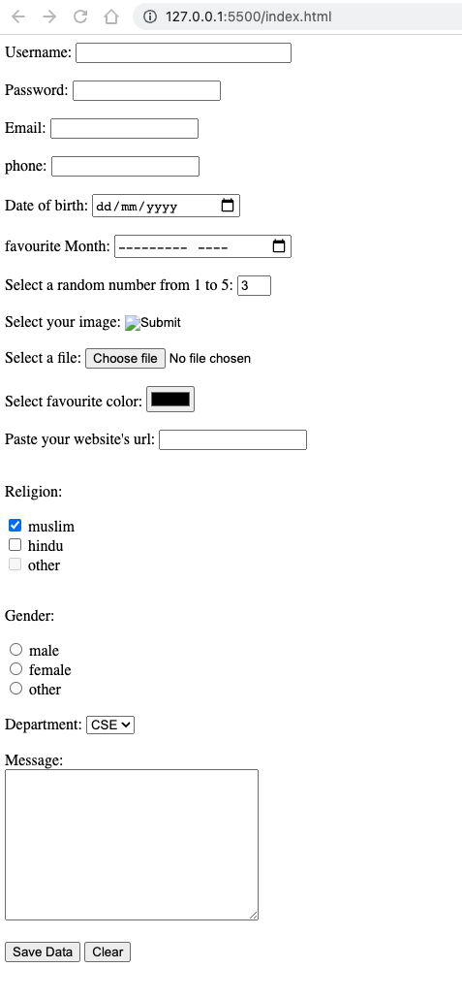

## 3. Advanced HTML

### 3.1 Multimedia - audio, video

#### audio

- `<audio> ... </audio>` tag helps us to add audio in our webpage
- `<audio> ... </audio>` tag has some attributes such as `controls autoplay muted height width`
- audio example shows how to add aduio source by using `<source />` tag
- Inside `<source />` tag we must define the `src=""` src address/name and also the `type=""` of audio
- as the example shows there are 2 `<source />` tag is used if the first format is not supported by the browser then second one will work. if first and second both is not supported by the browser then `Your browser does not support the audio element.` will work.

  audio Example

  ```html
  <audio controls autoplay muted height="300" width="300">
    <source src="anis.mp3" type="audio/mp3">
    <source src="anis.wav" type="audio/wav">
    Your browser does not support the audio element.
  </audio
  ```

#### video

- `<video> ... </video>` tag helps us to add video in our webpage
- `<video> ... </video>` tag has some attributes such as `controls autoplay muted height width`

video Example

```html
<video controls autoplay muted height="300" width="300">
  <source src="anis.mp4" type="video/mp4">
  <source src="anis.ogg" type="audio/ogg">
  Your browser does not support the video element.
</video
```

### 3.2 Meta tags & SEO

- Using meta tags (`<meta>`) to define page metadata, such as title, description, and keywords.
  Understanding the impact of meta tags on search engine optimization (SEO).

```html
<head>
  <meta charset="UTF-8" />
  <meta http-equiv="X-UA-Compatible" content="IE=edge" />
  <meta name="viewport" content="width=device-width, initial-scale=1.0" />
  <meta name="description" content="Free complete html tutorials 2021" />
  <meta name="keywords" content="HTML, html, html5" />
  <meta name="author" content="Anisul Islam" />
  <link rel="stylesheet" href="style.css" />
  <style>
    body {
      background-color: aquamarine;
    }
  </style>
  <script src="index.js"></script>
  <title>Document</title>
</head>
```

- Inside `<head>` tag we can define metadata(document title, character set, links, scripts, styles), other information that will not be visible to the users
- meta tag provides information to the browsers and search engines about the webpage
- `<meta charset="UTF-8" />` defines the character encoding for the HTML document.
- `<meta http-equiv="X-UA-Compatible" content="IE=edge" />` for supporting older version of IE.
- `<meta name="viewport" content="width=device-width, initial-scale=1.0" />` defines that webpage width is related to devices width and initial zoom level is 1.
- `<link rel="stylesheet" href="style.css">` generally connects css file to html. Inside of href attribute we give the css file name.
- `<style> ... </style>` we can use `<style> ... </style>` tag directly inside the head tag for designing html elements.
- `<script src="index.js"></script>` generally connects js file to html. we can also use `<script> ... </script>` tag directly inside the body tag.

### 3.3 Sematic HTML

- div can help to divide screen but it is not semantic
- purpose of HTML5

  - adding more semantic tags
  - more form types
  - improve accessibility
  - improved storage facilities
  - improved graphics & media
  - remove few things

- HTML5 Semantic elements: `<header> <nav> <main> <article> <aside> <section> <footer> <figure> <figcaption> <details> <summary> <mark> <time>`

- sematic tags vs non semantic tags

  - semantic tags are meaningful tags for human, search engine. example: `<form> <table> <p> <h1> etc.`
  - non-semantic tags are not meaningful tags for human, search engine. example: `<span> <div> etc.`
  - sematic tags vs non semantic tags example is given below:
    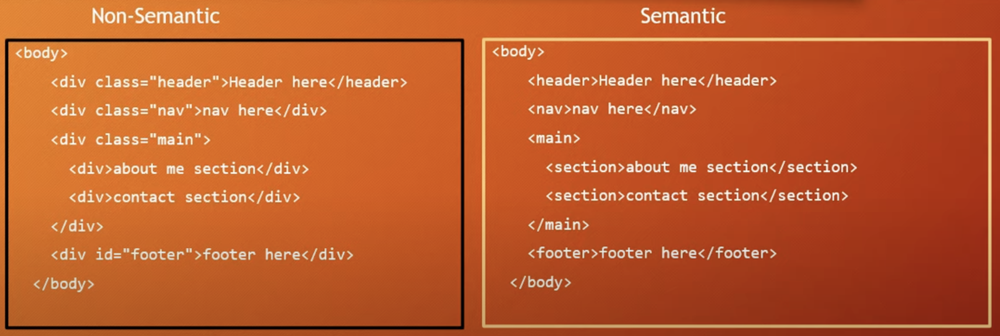

#### details and figure elements

- `<details>` elements have tewo states: closed, open
- `<summary>` a short summary of details is provided by summary element
- `<figure>` can have diagram, photos inside of it.
- `<figcaption>` can set the figure caption.

  An example of details, summary elements are given below:

  ```html
  <!DOCTYPE html>
  <html lang="en">
    <head>
      <title>Document</title>
      <style>
        details[open] > summary {
          background-color: aqua;
        }
      </style>
    </head>
    <body>
      <details>
        <summary>Anisul Islam</summary>
        My Name is Anisul Islam. I am 31 years old. I have done my masters in
        Software, Web & cloud at Tampere University, Finland.
      </details>

      <!-- no need to understand this part cause I just tested using javascript here -->
      <!-- <script>
        const details = document.querySelector("details");
        details.addEventListener("toggle", () => {
          if (details.open) {
            console.log("open");
          } else {
            console.log("close");
          }
        });
      </script> -->
      <figure>
        
        <figcaption>fig1: list image</figcaption>
      </figure>
    </body>
  </html>
  ```

  output of the heading style code  
   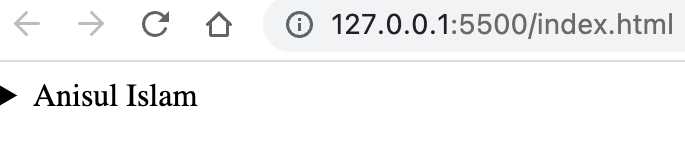
  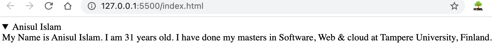

### 3.4 Web accessibility

- what is web accessibility?
  - making website supportive for disable people and search engine
- how to check web accessibility?
  - inspect -> lighthouse -> accessibility
  - axe Devtools for accessibility testing
  - chromeVox for screen reading

1. Use Semantic elements over non semantic elements.

- semantic tags are meaningful tags for human, search engine. example: `<form> <table> <p> <h1> etc.`
- non-semantic tags are not meaningful tags for human, search engine. example: `<span> <div> etc.`
- In the following example button is more accessible than div for making a button. Semantic elements help the screen readers.

```html
<div>Click me</div>
<button>Click me</button>
```

- Example of explicit semantic vs implicit sematic element

```html
<div role="button">Click me</div>
<button>Click me</button>
```

- landmarks helps to naviagte from one place to another: header, h1...h6, main, nav, footer

2. Use Heading tags in order

- use one h1 element in a webpage
- keep sequence when using: h1 -> h2 -> h3 ... (follow top-down order)

3. Use alt attribute

- use alt attribute for `` element
- alt attribute provides more info to the blind people
- low bandwidth might not render the image so the alt will help here
- alt attributes helps technologies like search engines
- title attribute can be used when we hover over image to get extra information

4. Contrast ratio checker

- use contrast ratio checker for foreground and background color: https://webaim.org/resources/contrastchecker/

5. Declare the languages

- `<html lang="en">`

6. Meaningful Link txt

- make link text descriptive, understandable and clear `<a href="http://studywithanis.com" target="_blank"> Visit Anisul Islam's website </a>`

7. Form related matters

- use label and bind input elements with label by using id and for value same. example is given below:

  ```html
  <label for="email">Email: </label> <input type="email" id="email" />

  <div class="form-control">
    <fieldset>
      <legend>Choose Gender:</legend>
      <div class="form-control">
        <input type="radio" id="male" name="gender" value="male" />
        <label for="male">Male</label>
      </div>
      <div class="form-control">
        <input type="radio" id="female" name="gender" value="female" />
        <label for="female">Female</label>
      </div>
    </fieldset>
  </div>
  ```

8.  use aria-label vs aria-labelby vs aria-descriptionby

- these attribute has no visual impact but they are for assistive purpose. use them only when you can not use semantic elements
- The aria-label and aria-labelledby attributes are both used to give an element it's accessible name.
- using forms with standards labels - you shouldn't need it at all: -> label, for is more than enough
- **_aria-label_** add accessible name directly to an element and it has higher priority than the element value. In the following example screen reader will say learn more about me instead of learn more

  ```html
  <button aria-label="Learn more about me">Learn more</button>
  ```

- **_aria-labelby_** create a relationship between elements

  ```html
  <h3 id="hobbies">Hobbies</h3>
  <ul aria-labelledby="hobbies">
    <li>Playing Football</li>
    <li>Playing Badminton</li>
    <li>Swimming</li>
  </ul>
  ```

- **_aria-descriptionby_**

  ```html
  <div>
    <label for="password"> Password </label>
    <input
      type="password"
      name="password"
      id="password"
      aria-describedby="help"
      required
    />
    <div id="help">Pasword must be at least 8 character long</div>
  </div>
  ```

9. role and tabindex -> tabindex can start from 0 then -1, -2 for lesser priority so that you can navigate by keyboard one after one in an order

```HTML
  <!-- use nav, role, tabindex, aria-label for an accessible navbar  -->

  <!-- NOT ACCESSIBLE -->
  <div id="nav">
    <a href="#">Home</a>
    <a href="#about">About Me</a>
    <a href="#tutorial">Tutorials</a>
    <a href="#contact">Contact Me</a>
  </div>

  <!-- ACCESSIBLE  -->
  <nav aria-label="navigation menu">
    <ul id="menubar" role="menubar" aria-label="navigation menu">
      <li role="none">
        <a href="#" role="menuitem" tabindex="-1">Home</a>
      </li>
      <li role="none">
        <a href="#about" role="menuitem" tabindex="-1">About Me</a>
      </li>
      <ul role="menu" aria-label="tutorials">
        <li role="none">
          <a href="#tutorials" role="menuitem" tabindex="0">Tutorials</a>
          <ul>
            <li role="none">
              <a href="#html" role="menuitem" tabindex="-1">HTML</a>
            </li>
            <li role="none">
              <a href="#css" role="menuitem" tabindex="-1">CSS</a>
            </li>
          </ul>
        </li>
      </ul>
      <li role="none">
        <a href="#contact" role="menuitem" tabindex="-1">Contact Me</a>
      </li>
    </ul>
  </nav>
```

- References:
- https://www.w3.org/WAI/fundamentals/accessibility-intro/
- https://www.w3schools.com/html/html_accessibility.asp

### 3.5 Graphics

#### progress bar and svg

- ``
- `<progress min="0" max="100" value="70"> </progress>`
  <progress min="0" max="100" value="70"> </progress>
- you will learn more about svg and canvas in CSS and Javascript playlist

### 3.6 HTML5 API

- Exploring HTML5 APIs like Geolocation, Drag and Drop, Web Storage, and Web Workers. Understanding their usage and practical applications.

1. **Geolocation API**:

   - The Geolocation API allows you to retrieve the user's geographic location information.
   - Example:

     ```js
     if (navigator.geolocation) {
       navigator.geolocation.getCurrentPosition(function (position) {
         var latitude = position.coords.latitude;
         var longitude = position.coords.longitude;
         console.log('Latitude: ' + latitude + ', Longitude: ' + longitude);
       });
     } else {
       console.log('Geolocation is not supported by this browser.');
     }
     ```

2. **Drag and Drop API**:

   - The Drag and Drop API enables you to create drag-and-drop interactions between elements on a web page.
   - Example:

     ```javascript
     var draggableElement = document.getElementById('draggable');
     var dropZone = document.getElementById('drop-zone');

     draggableElement.addEventListener('dragstart', function (event) {
       event.dataTransfer.setData('text/plain', event.target.id);
     });

     dropZone.addEventListener('dragover', function (event) {
       event.preventDefault();
     });

     dropZone.addEventListener('drop', function (event) {
       event.preventDefault();
       var data = event.dataTransfer.getData('text/plain');
       var element = document.getElementById(data);
       dropZone.appendChild(element);
     });
     ```

3. **Web Storage API**:

   - The Web Storage API provides a way to store key-value pairs locally in the user's browser.
   - Example:

     ```javascript
     // Store data
     localStorage.setItem('username', 'John');

     // Retrieve data
     var username = localStorage.getItem('username');
     console.log(username);

     // Remove data
     localStorage.removeItem('username');
     ```

4. **Canvas API**:

   - The Canvas API allows you to draw graphics and animations on a web page using JavaScript.
   - Example:

     ```javascript
     var canvas = document.getElementById('my-canvas');
     var context = canvas.getContext('2d');

     context.fillStyle = 'red';
     context.fillRect(50, 50, 100, 100);

     context.strokeStyle = 'blue';
     context.lineWidth = 2;
     context.strokeRect(75, 75, 50, 50);

     context.beginPath();
     context.arc(150, 150, 50, 0, 2 * Math.PI);
     context.fillStyle = 'green';
     context.fill();
     context.closePath();
     ```

### 3.7 HTML Templates and Web Components

- Building reusable HTML templates and components using `<template>` and custom elements.

  ```html
  <template id="user-template">
    <div class="user-card">
      <h2 class="user-name"></h2>
      <p class="user-email"></p>
    </div>
  </template>

  <script>
    // Clone the template and populate the data
    var template = document.getElementById('user-template');
    var clone = template.content.cloneNode(true);
    clone.querySelector('.user-name').textContent = 'John Doe';
    clone.querySelector('.user-email').textContent = 'john.doe@example.com';

    // Insert the cloned template into the document
    document.body.appendChild(clone);
  </script>
  ```

- Leveraging frameworks like Angular, React, or Vue.js for more advanced component-based development.
